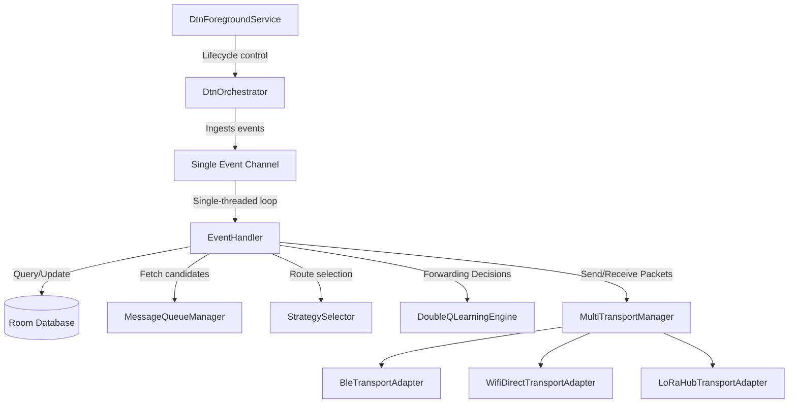

# DTN Mesh Relay Messaging App

An off-grid, peer-to-peer (P2P) delay-tolerant messaging application for Android. It operates without cellular coverage or internet connectivity by employing a Store-Carry-Forward routing model across multiple physical transports. 

The application optimizes forwarding decisions in real time by combining classical routing protocols (**PRoPHET** and **MaxProp**) with a modern **Double Q-Learning** reinforcement learning (RL) engine.

---

## Architecture Overview

The core system components are structured using clean, modular architectural principles coordinated by a centralized thread-safe orchestrator.



### Key Components

1. **`DtnForegroundService`**: Maintains the application stack in the background, prevents OS process reclamation, handles system broadcast notifications, and manages power locks during mesh synchronization.
2. **`DtnOrchestrator`**: A single-threaded event loop driven by a Kotlin Coroutine `Channel`. It processes all transport events (encounters, packet receptions, delivery statuses) sequentially to guarantee race-free mutations of the Q-tables and the message queue database. Blocking radio transmissions are offloaded from the loop into a **coalesced, bounded-concurrency flush** (parallel per-peer fan-out with a per-peer lock, connect backoff, and receipt de-duplication) so one slow or unreachable phone never stalls delivery to the others.
3. **`MultiTransportManager`**: Abstractly merges heterogeneous transport adapters (BLE, Wi-Fi Direct, LoRa Hub) into a unified send/receive API.
4. **`MessageQueueManager`**: Manages store-and-forward bundles, checks message validity, enforces storage quotas, and provides candidate message lists for encountered peers.
5. **`StrategySelector`**: Manages the active routing model — PRoPHET (RFC 6693), STABLE-PROPHET, MaxProp (cost-based Dijkstra), Epidemic, or Double Q-Learning — computing current transit delivery probabilities for each peer and ranking buffered bundles for a given encounter.
6. **`DoubleQLearningEngine`**: The reinforcement learning kernel that decides whether to immediately **FORWARD** a message to an encountered peer or **STORE/WAIT** for a better future encounter.
7. **`ForwardingWorker`**: A Hilt-injected periodic **WorkManager** job (15-minute cadence) that performs *background housekeeping only* — TTL expiry, reverting timed-out forwards, purging terminal messages, periodic routing aging, draining pending Q-updates to the orchestrator, buffer-pressure enforcement, and low-reachability drops. Real-time forwarding stays on the orchestrator's encounter path. Because it uses `@AssistedInject`, the `DtnMeshApplication` supplies a `HiltWorkerFactory` through `Configuration.Provider` (and the manifest removes WorkManager's default initializer) so the worker's injected dependencies resolve when Android runs it in the background.

---

## Heterogeneous Transport Layers

The application operates over three independent physical layers:

### 1. Bluetooth Low Energy (BLE) (`BleTransportAdapter`)
* **Split Advertising**: To fit within the 31-byte legacy advertising payload limit:
  * The **Main Advertisement Packet** contains the Service UUID.
  * The **Scan Response Packet** carries the `Service Data` which encapsulates the local Node ID.
* **GATT Server**: Opens a local GATT Server featuring a single Characteristic with WRITE properties (`PROPERTY_WRITE` and `PROPERTY_WRITE_NO_RESPONSE`) allowing centals to write serialized DTN packets.
* **Central/Peripheral Roles**: Alternates between advertising (Peripheral mode) and scanning (Central mode). When it finds a peer, it connects as a central, transmits outstanding payloads, and disconnects.

### 2. Wi-Fi Direct P2P (`WifiDirectTransportAdapter`)
* Used for high-bandwidth bulk message exchanges.
* Coordinates Group Owner (GO) negotiation and uses raw TCP sockets (`ServerSocket` and `Socket`) to synchronize queue indices and dump large message batches.

### 3. LoRa Hub Bridge (`LoRaHubTransportAdapter`)
* Connects to a **custom ESP32 LoRa hub** (Heltec WiFi LoRa 32 V3 running the firmware in `firmware/`), which the phone joins as a **WiFi station** to the hub's SoftAP (SSID prefix `DTN-HUB-`).
* Speaks a framed TCP protocol on port **9740** (`HELLO` / `REGISTER` / `BUNDLE`), bridging the short-range IP link to the long-range, low-bandwidth sub-GHz LoRa hub-to-hub backbone. This is **independent of Meshtastic** — the hub runs our own firmware, not the Meshtastic stack.

---

## Routing & Reinforcement Learning Engine

The core forwarding path uses a hybrid model where classical probabilities feed as inputs into a Double Q-Learning state formulation. Five routing strategies are selectable at runtime: **PRoPHET**, **STABLE-PROPHET**, **MaxProp**, **Epidemic**, and **Double Q-Learning**.

### PRoPHET — Probabilistic Routing (RFC 6693)

The default strategy implements the **PRoPHETv2 / RFC 6693** delivery-predictability model ([Lindgren et al., RFC 6693](https://www.rfc-editor.org/rfc/rfc6693)). Each node maintains a delivery predictability `P(a, b) ∈ [0, 1]` per known destination, updated on three events:

* **Direct encounter (delta-capped):**

  $$P(a,b) = P(a,b)_{old} + (1 - \delta - P(a,b)_{old}) \cdot P_{enc}$$

  The cap `1 − δ` (with `δ = 0.01`) means predictability asymptotes toward `0.99` and **never saturates to 1.0** — the fix for the earlier instability where a single close encounter pegged `P` at 1.0 and stranded messages. `P_enc` (`P_init = 0.75`) is **adaptive**: a re-encounter faster than the typical inter-contact interval `I_typ` (30 s) is scaled by `interval / I_typ`, so a peer that stays in radio range does not over-inflate its predictability.
* **Aging:** $P(a,b) = P(a,b) \cdot \gamma^{k}$ over `k` elapsed intervals (`γ = 0.98`).
* **Transitivity:** $P(a,c) = P(a,c) + (1 - P(a,c)) \cdot P(a,b) \cdot P(b,c) \cdot \beta$ (`β = 0.25`), learned from a peer's exchanged predictability summary.

**STABLE-PROPHET** is a variant that replaces the adaptive scalar with a smoothed-RSSI + contact-recurrence *link-quality* weight, rewarding durable links over transient close pings.

### MaxProp — Cost-Based Path Routing (INFOCOM 2006)

MaxProp ([Burgess et al., IEEE INFOCOM 2006](https://ieeexplore.ieee.org/document/4146849)) treats routing as a **shortest-path problem over delivery-likelihood edges**. Each node's likelihood vector `f` (normalized encounter frequency, `Σf = 1`) defines per-edge cost `(1 − f)`. Using neighbours' `f`-vectors cached from routing-summary handshakes, the engine runs **Dijkstra** from a synthetic source over these costs to find the minimum-cost path to a destination, and forwards a bundle to a peer only when that peer is the **min-cost next hop**. Freshly-injected bundles (`hopCount ≤ 1`) receive a **head-start** priority multiplier so they spread before older copies; a hard hop limit bounds runaway flooding.

### Double Q-Learning Model

To avoid the maximization bias inherent in standard Q-learning, the engine maintains two independent Q-tables ($Q^A$ and $Q^B$), updating them randomly on incoming experience tuples.

#### 1. State Space ($S$)
The state is a 9-dimensional normalized vector representing the current context:
* `rssiNorm`: Normalized RSSI of the connection $[0, 1]$.
* `snrNorm`: Normalized SNR of the connection $[0, 1]$.
* `encounterFrequency`: Number of direct encounters with this peer in the last 24 hours.
* `encounterDuration`: Running average duration of previous encounters.
* `deliveryProbability`: Composite delivery probability from classical models (PRoPHET/MaxProp).
* `remainingTtlFraction`: Remaining Time-To-Live fraction of the bundle $[0, 1]$.
* `bufferOccupancy`: Local queue storage occupancy fraction $[0, 1]$.
* `historicalSuccessRate`: Historical percentage of successful deliveries via this peer.
* `duplicateCountNorm`: Normalized count of identical packets seen in the mesh.

#### 2. Action Space ($A$)
* `FORWARD`: Transmit the packet to the encountered peer.
* `STORE_WAIT`: Keep the packet in local storage and wait for a better contact.

#### 3. Reward Function ($R$)
Rewards are backfilled dynamically using a differentiated credit assignment:
* **Direct Delivery**: $+1.0$ when the packet is successfully delivered to its destination.
* **Intermediate Forwarding**: Positive fraction $+0.3$ is assigned to intermediate nodes that successfully routed the message.
* **Failure / Expiry**: $-0.5$ if the packet fails transmission, and $-0.2$ if it expires in queue without delivery.

---

## Database Schema

The persistence layer is managed by Room (`AppDatabase`).

### 1. `contacts` Table
Stores historical contact profiles for known mesh nodes.
* `node_id` (String, Primary Key)
* `delivery_probability` (Double)
* `total_encounters` (Int)
* `total_encounter_duration_ms` (Long)
* `best_rssi` / `last_rssi` (Int)
* `best_snr` / `last_snr` (Float)
* `delivery_success_count` (Int)
* `delivery_attempt_count` (Int)

### 2. `encounters` Table
Logs individual connection windows.
* `id` (Long, Auto-Generate Primary Key)
* `peer_node_id` (String)
* `start_time_ms` / `end_time_ms` (Long)
* `best_rssi` (Int)
* `best_snr` (Float)

### 3. `messages` Table
Maintains the Store-Carry-Forward message store.
* `id` (String, Primary Key)
* `origin_node_id` / `destination_node_id` (String)
* `payload` (Blob)
* `ttl_ms` / `created_at_ms` / `expires_at_ms` (Long)
* `hop_count` / `forward_count` / `duplicate_count` (Int)
* `status` (String — BUFFERED / FORWARDING / DELIVERED / EXPIRED / DROPPED)
* `message_type` (String) · `last_forwarded_to` (String, Nullable)

### 4. `forwarding_decisions` Table
An instrumentation table recording RL training steps.
* `id` (Long, Primary Key)
* `timestamp_ms` (Long)
* `message_id` (String)
* `peer_node_id` (String)
* `state_*` (Normalized state features)
* `action` (String - FORWARD/STORE_WAIT)
* `q_value_selected` (Double)
* `reward` (Double, Nullable)

---

## Research Data Export

For offline analysis and benchmarking, the full research archive can be exported from the **Log tab** ("Export telemetry" button). `ResearchExporter` gathers the data and `FileExportHelper` writes it to app storage:

* `encounters.csv` — every contact window (peer, start/end, best RSSI/SNR).
* `contacts.csv` — per-node delivery-probability profiles and success/attempt counters.
* `decisions.csv` — Double Q-Learning forwarding decisions with the 9-feature state, chosen action, selected Q-value, and backfilled reward.
* `messages.csv` — the store-carry-forward message store with hop/forward/duplicate counts and terminal status.
* `q_tables.json` — serialized `Q^A` / `Q^B` tables.
* `metadata.json` — run metadata (local identity, timestamps, record counts).

---

## Compilation and Deployment

### Prerequisites
* Android SDK (API 34+)
* Java Development Kit (JDK) 17
* Gradle 8.2+

### Building the Project
To compile the application and generate a debug APK:
```bash
# Set your Android SDK path (if needed)
$env:ANDROID_HOME="C:\Users\<YourUsername>\AppData\Local\Android\Sdk"

# Compile and package the debug build
./gradlew :app:assembleDebug
```
The output APK will be generated at:
`app/build/outputs/apk/debug/app-debug.apk`

### Installation
Deploy the APK to a connected Android device via ADB:
```bash
adb install -r app/build/outputs/apk/debug/app-debug.apk
```

### Monitoring Logs
Filter the system logs to inspect connection states, split advertising packets, or routing decisions:
```bash
adb logcat -s BleTransport:* MultiTransport:* DtnOrchestrator:* WifiDirectTransport:*
```
